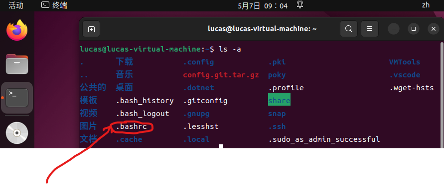
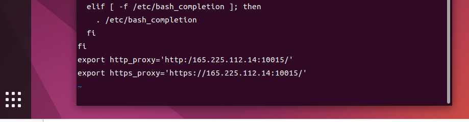
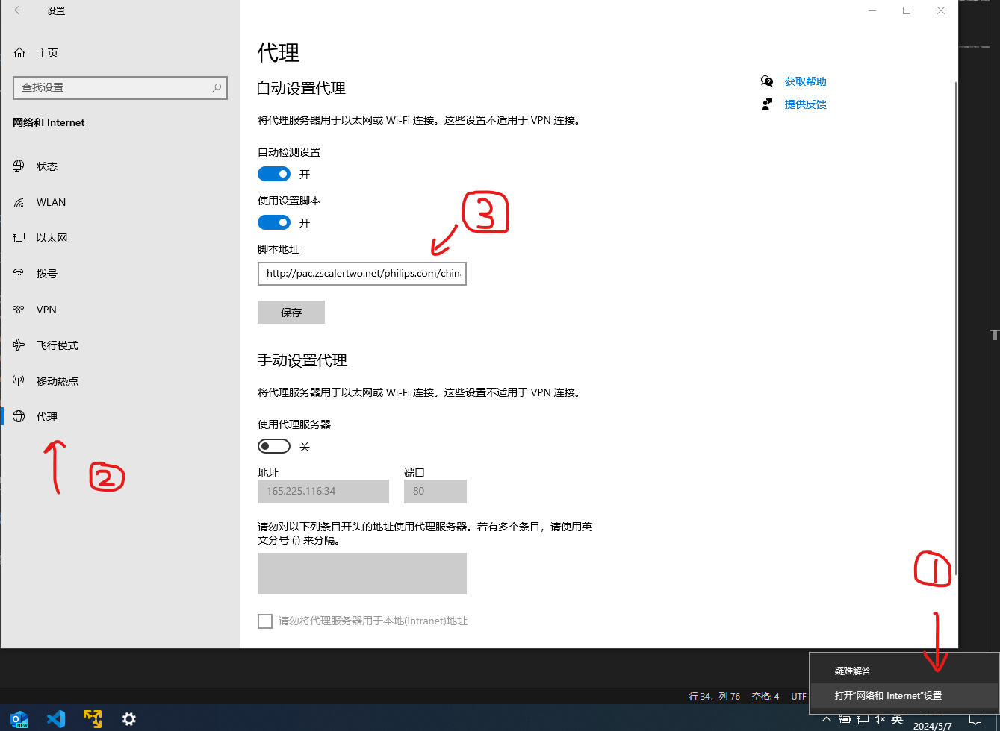

# Bash_Proxy

[返回](./Index.md)

## 概括

要找到bash的代理然后更改~/.bashrc文件增加如下代理（根据自己的代理设置），就可以使用公司内网快速的进行bitbake命令了
export http_proxy='http:/165.225.112.14:10015/'
export https_proxy='<https://165.225.112.14:10015/>'

在Ubuntu命令行中，'~'表示当前用户目录，通常是"/home/username/"。

## 找到"~/.bashrc"文件

.bashrc文件隐藏在了用户目录下，可以使用如下命令

```bash
ls -a
```



## 修改"~/.bash.rc"文件

进入.bashrc文件，在文件中设置如下环境变量

```bash
export http_proxy='http://myproxy.example.com:1080/'
export https_proxy='https://myproxy.example.com:1080/'  
export ftp_proxy='http://myproxy.example.com:1080/'
export ALL_PROXY='socks://myproxy.example.com:1080/'  
export all_proxy='socks://myproxy.example.com:1080/'  
export no_proxy='example.com'
```

NOTE:
一般只需要增加前两个"http"和"https"就可以了，别的可以不加。


## 查找自己的代理服务器和端口号

找到电脑右下角网络图标，右键->打开“网络和Internet”设置->代理->脚本地址->复制->粘贴到浏览器->下载




之后找到下载的文件，示例中为china-vip-pac.pac，打开。
寻找代理服务器和端口号（有很多，随便找一个，如果不行就换一个）

