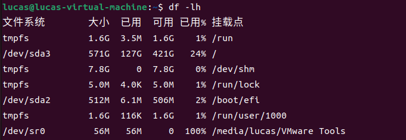
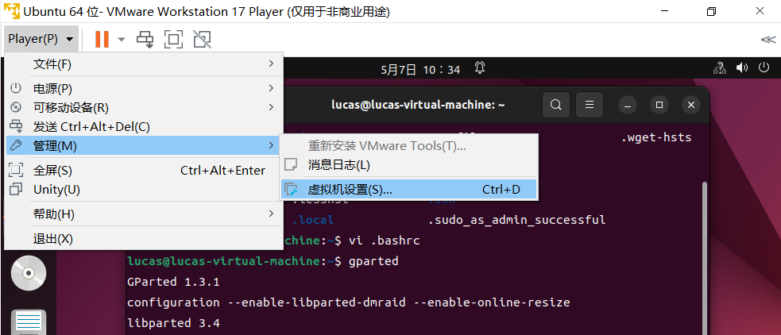
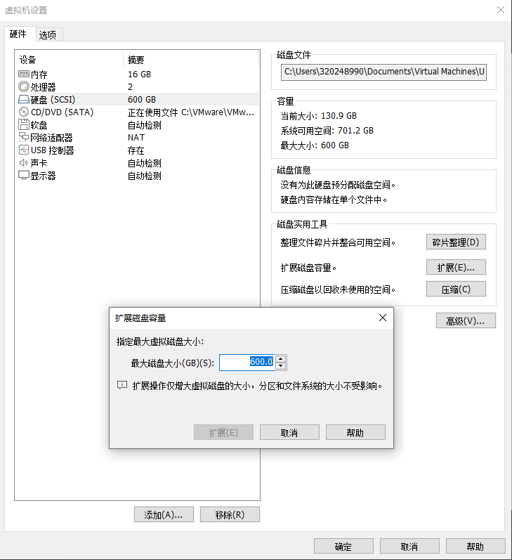
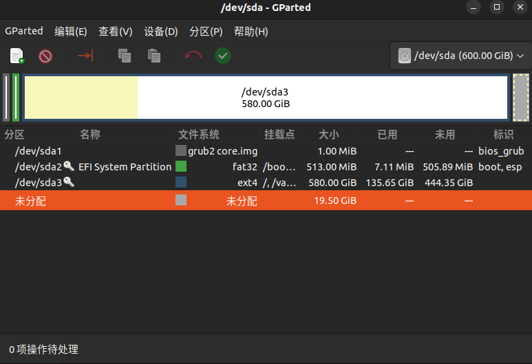
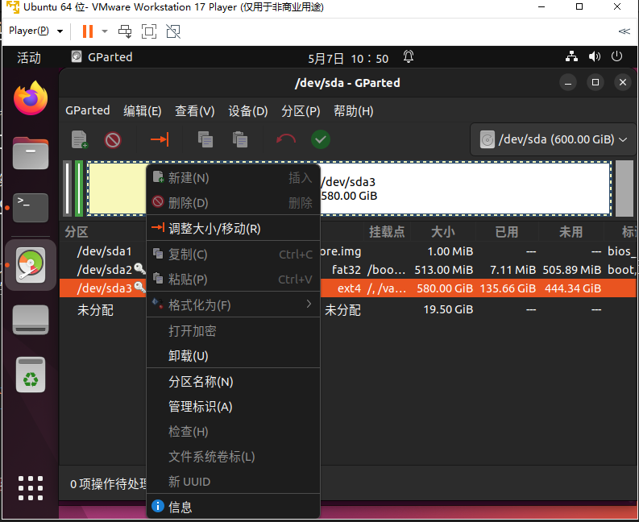
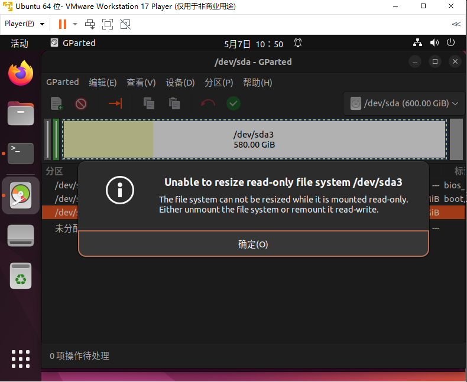
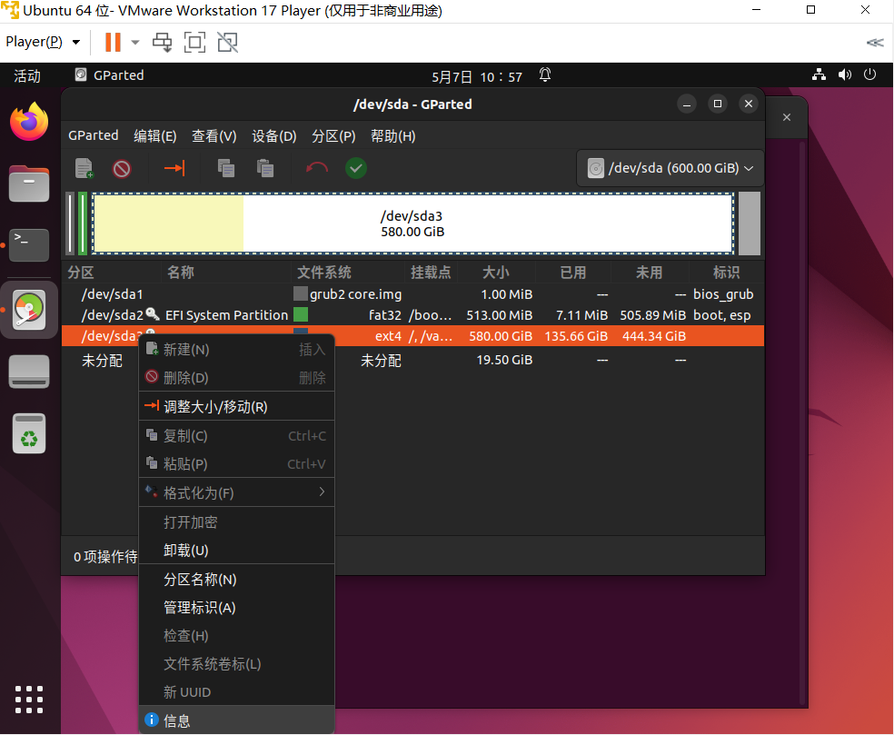
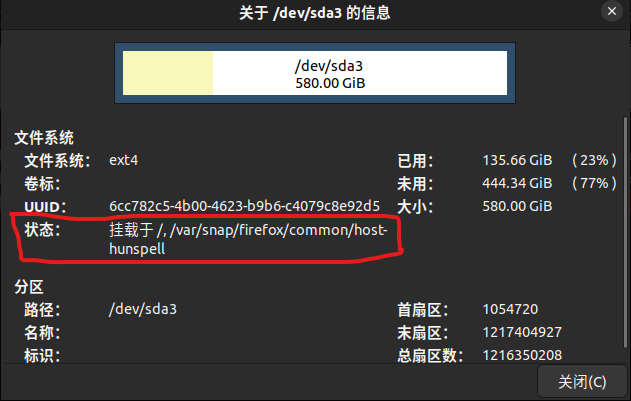
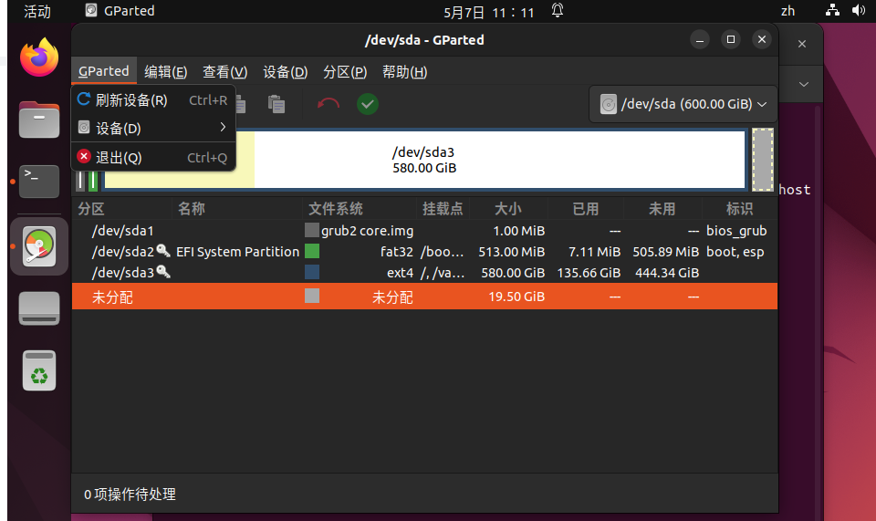
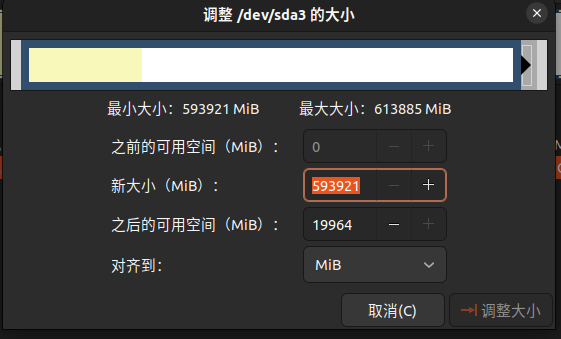

# 扩展虚拟机磁盘空间——Linux分区利器：GParted

[返回](./Index.md)

## 查看磁盘使用情况

使用如下指令查看目前虚拟机磁盘使用情况

```bash
df -lh
```



## 为虚拟机分配磁盘空间

**1.** 在虚拟机未开机的前提下，打开虚拟机左上角Player(P)->管理->虚拟机设置


**2.** 硬盘->扩展->选择想要分配给虚拟机的磁盘空间->确定


> **NOTE**  
> 这里分配给了虚拟机新的磁盘空间之后，虚拟机并没有将其分配给磁盘上，而是多了一个未分配区域，我们需要将这个未分配区域划分给我们想要扩展的虚拟机的磁盘，从而达到扩展磁盘空间的目的。

## 安装GParted

```bash
sudo apt update
sudo apt install gparted
```

## 启动GParted

安装完成后使用如下命令就可以启动图像化界面：（需要root权限）

> `$ gparted`  


## 扩展想要扩展的磁盘（示例中选择的是sda3）

### 1 选择自己想要扩展的磁盘->右键->调整大小/移动



### 2 若产生如下警告则说明磁盘只读，需要重新挂载文佳佳目录的读写权限。若没有产生如下提示，直接跳转到第6步



### 3 查看只读文件系统的详细信息，选择自己想要扩展的磁盘->右键->信息



### 4 查看该磁盘的挂载的文件夹目录（注意：挂载的位置使用','隔开，容易忽略两个挂载点中的'/'）

示例中的挂载位置为：`/` 和 `/var/snap/firefox/common/host-hunspell`



### 5 使用root权限打开中断，重新挂载文件夹目录的读写权限

```bash
sudo -i
mount -o remount -rw / 
mount -o remount -rw /var/snap/firefox/common/host-hunspell 
```

### 6 刷新GParted中的设备之后，就可以调整了



