# 软件组使用Github进行软件代码管理的流程

[返回目录](./Index.md)

## 一、拉代码到自己PC

1. 创建一个文件夹，并使用 VSCode 打开这个文件夹。
2. 使用快捷键`Ctrl + ~`打开终端。
3. 输入指令`git clone + 你要克隆的仓库的网址`。

这样你的仓库就建立好了

## 二、在本地进行工作

1. 首先使用快捷键`ctrl + ~`打开终端。
2. 输入`git branch + 分支名称`，这里创建的分支名称要和你将要进行的工作相关，例如：接下来你要进行github_work_flow的编写，那么你就可以将你的分支命名为 `github_work_flow`。
3. 输入`git checkout + 分支名称`，切换到刚刚创建的分支上。
4. 进入到对应分支之后就可以在这个分支上进行代码的更改了。

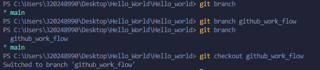

## 三、上传代码

当你完成了代码开发，需要将代码上传到 Github 上，那么你可以按照如下流程操作：

1. 首先使用快捷键`ctrl + ~`打开终端。
2. 输入`git add .`保存你的代码。
3. 输入`git commit -m '注释'`来提交你的代码。
4. 输入`git push -u origin + 分支名称`来将你的代码上传到Github上的分支上。

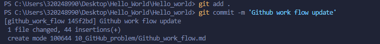
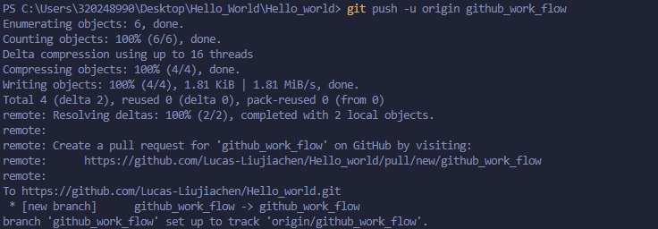

## 四、提出PR(Pull request)

完成了上述步骤，还远远不够，你的代码还只是停留在你创建的分支中，并不能直接 merge 到主分支中，这时你需要如下操作:

1. 在你完成你的代码上传后，可以打开你的 Github，这时你会发现你的分支上会出现一行提示，提示你要不要进行 Pull request，点击它。
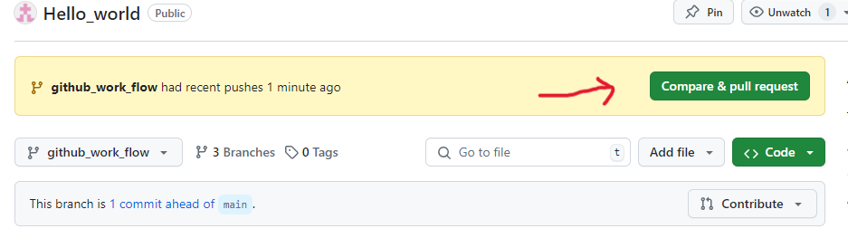
2. 随后你将需要对你进行的更改进行**详细的描述**。（详细的描述很重要，这样会方便别人 review 你的变动，可以更快的让你将你的更改合并到主分支中）
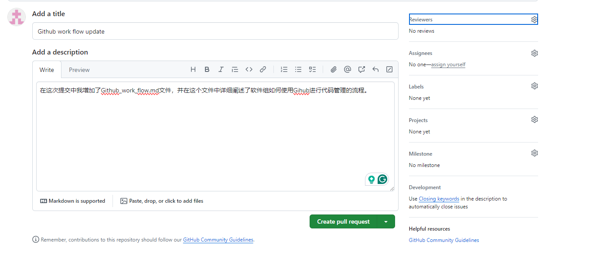
3. 在进行更改描述的同一页的右侧，你可以看到一个 Reviewers 的选项，这个选项中你可以选择让哪些人对你的提交进行 Code Review。Code Review 是一个十分重要的过程，这保证了我们仓库的安全以及代码让相关人员知晓相关的更改，只有当所有的 Reviewers 同意了你的更改之后，你才能进行下一步。
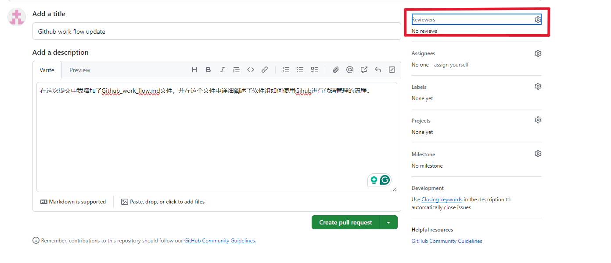
4. 当所有的 Reviewers 统一的你的更改之后，这时应该已经过去一段时间了，你需要重新打开这个页面，将页面下拉，你就会看到一个绿色的写着 Merge 的按钮，点击这个按钮，并 Confirm Merge，**并删除刚刚 merge 到主分支的你的分支**。
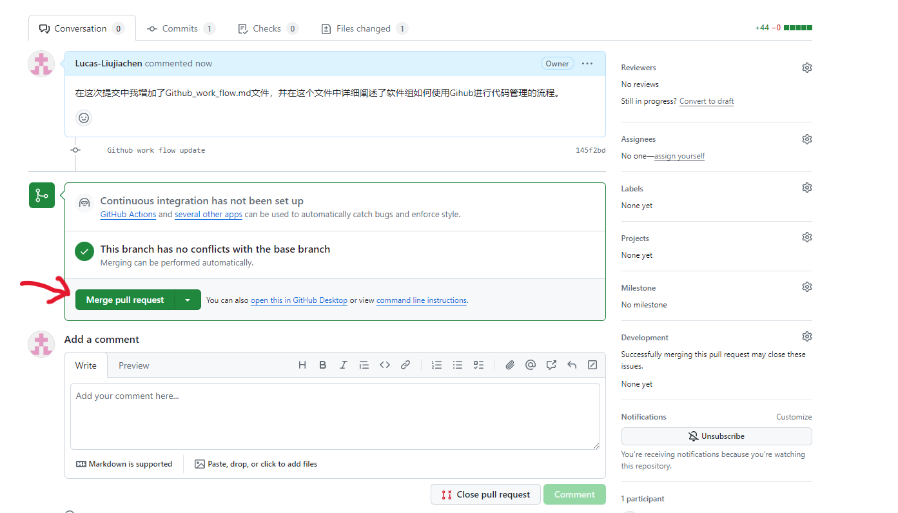
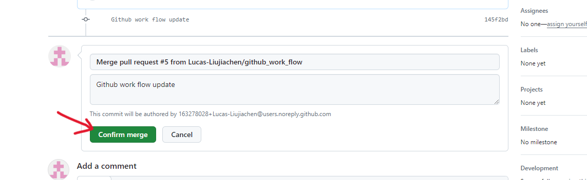

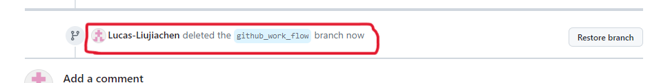
5. 当你完成上述操作之后，请返回最初的仓库界面，如果看到你的创建的分支不见了，并且合并到了你的主分支上，那么恭喜你成功了。
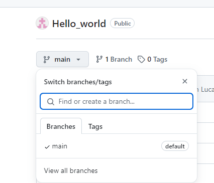

此外，如果你被别人指定为 Code Reviewer，那么你可以点击 Pull request 界面上方的一个选项查看更改的文件都有哪些，并在切换后的页面的右上角有一个按钮可以点击输入你对这部分代码的 Comments。
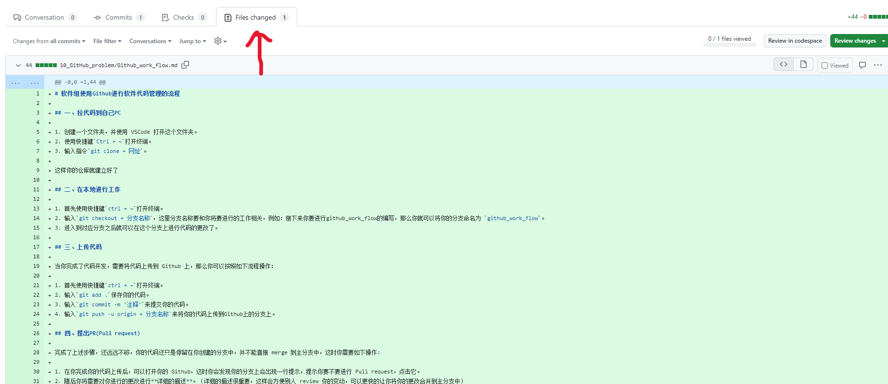
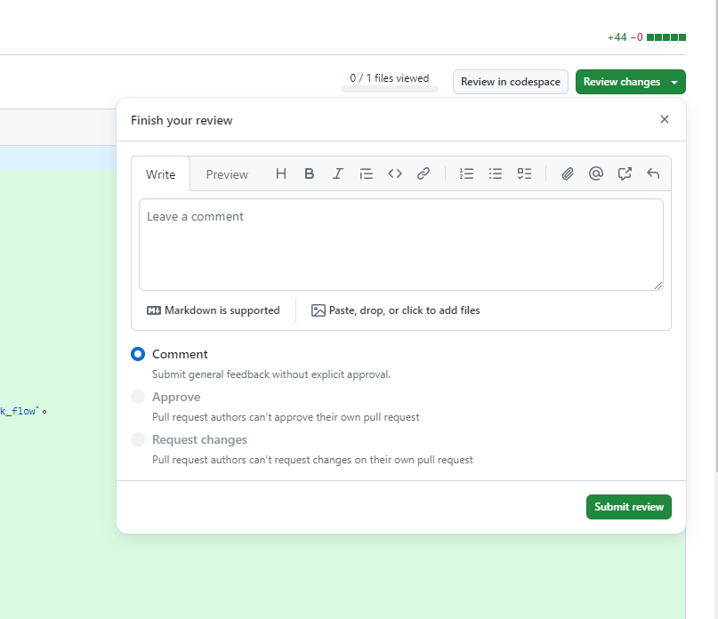

## 五、新的工作

完成一个分支的上传和合并，并不是代码管理的全部工作，这时你的本地还存在着你刚刚删除的分支、你的PC上的主分支还是 merge 之前的主分支需要更新，这时回到你的 PC，进行如下操作：

1. 首先使用快捷键`ctrl + ~`打开终端。
2. 输入`git checkout + 主分支名称`，切换到主分支上。
3. 输入`git branch -D + 你要删除的分支名称`，由于你的分支已经合并到主分支上，并且你在 Github 上也删除了这个分支，因此你的本地 PC 也需要删除这个分支。
4. 删除完成后，在主分支中输入`git pull`，更新你的主分支。
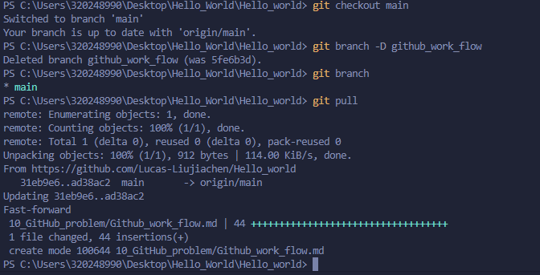

完成上述工作之后，如果你有新的工作需要修改代码，就回到第二步，重新建立分支，开始流程即可。
