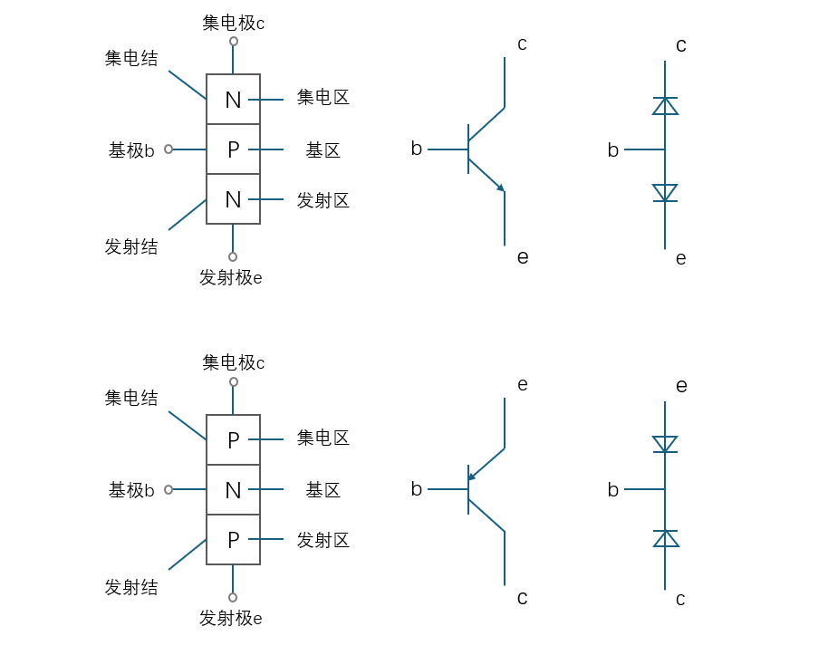

# \[电路图学习笔记\]

## 一、三极管

**半导体三极管(Bipolar Junction Transistor)**，也称双极型晶体管、晶体三极管，英文缩写BJT。
它是由两个PN结构成，三条引线分别称为 **发射极e （Emitter）、 基极b (Base)和 集电极c (Collector)**
示意图如下：

三极管的工作状态称为**正偏**，正偏的逻辑是电流从P流向N
因此两种三极管原理可以划分为如下

> 三极管的三种工作状态
>
> - 截止状态：当发射极与集电极出现反向偏置时，三级管进入截止状态
> - 导通状态
>   - 放大状态：当三极管发射极正向偏置，集电极反向偏置，三极管就进入放大转态。
>   - 饱和状态：当三极管发射极正偏，集电极正偏时，三极管工作在饱和状态

I=电流
I~e~ = I~b~ + I~c~
这就是说，在基极补充一个很小的Ib，就可以在集电极上得到一个较大的Ic，这就是所谓电流放大作用，Ic与Ib是维持一定的比例关系
β~1~ = I~c~ / I~b~
式中：β~1~称为直流放大倍数

## 二、二极管
