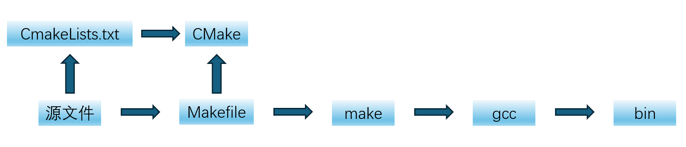

# \[CMake学习笔记\]

## 一、核心概念

**gcc(GNU Complier Collection)** 将源文件**编译(Compile)** 成可执行文件或者库文件；

而当需要编译大量文件时，需要先说明先编译什么，后编译什么，这个过程称为**构建(Build)**。常用工具为**make**，其定义构建过程的文件为**Makefile**；

编写大型项目的Makefile十分复杂，通过**CMake**就可以更简洁的定义构建流程，其中CMake定义构建过程的文件为**CMakeLists.txt**。

其大致关系图如下：


## 二、核心语法

### *2-1基本概念*

CMake的命令有三种不同的类型：**脚本命令、项目配置命令、测试命令**。

CMake语言在项目配置中的组织为三种源文件类型：

1. 目录：CMakeLists.txt，这妞的是一个目录，其中描述了如何针对该目录（Source tree）生成构建系统，会使用配置命令。
2. 脚本：&lt;script&gt;.cmake，就是一个CMake语言的脚本文件可使用`cmake -P`直接执行，其中只能包含脚本命令。
3. 模块：&lt;module&gt;.cmake，其中实现了一些模块化的功能，可以被嵌满两者包含，比如`include(CTest)`启动测试功能。

CMake的命令格式：

- command (arg1 ag2 ...)
- command为cmake支持的命令，括号中是参数，**参数之间用空格分开**

> 比如生成一个静态库目标：
> add_library (${MATH_LIB} STATIC math.cpp)
> 指令为add_library指令，告诉cmake生成一个库目标。
>
> - 第一个参数表示要生成的库的目标的名字，这里取上层目录传入的变量MATH_LIB的值作为目标名。
>
> - 第二个参数STATIC表示生成一个静态库。
>
> - 第三个参数math.cpp表示cmake编译静态库需要的的源代码文件。

其中CMake中主要概念为：命令（command），目标（target）和变量。
取值的方法为：**${var}**

**小结**：

1. CMake是通过CMakeLists.txt配置项目的构建系统，配合cmake命令行工具生成构建系统并执行编译、测试。
2. 最大的好处是一份make构建可以支持多个平台。
3. 指令格式为`command (arg1 ag2 ...)` **变量之间使用空格隔开**。
4. set指令可以给一个变量一个或者一组值，可以使用${var}的方式取变量的值。
5. 三种为CMake指定编译器的方式：
   （1）使用set命令通过修改CMAKE_CXX_COMPILER变量的方式指定编译器。
   （2）在系统环境变量中增加名为CC或者CXX的环境变量（分别对应C和C++的编译器）。**推荐使用**
   （3）在命令行执行cmake命令`cmake -D CMAKE_CXX_COMPILER=g++/clang++`。

### *2-2基本语法*

#### 2-2-1 注释

单行注释使用: "#" ;
多行注释使用: "#\[\[Some comments can be multi lines or in side the command]]"。

#### 2-2-2 变量

CMake中使用`set`和`unset`命令设置或者取消设置变量。CMake常用变量为:**一般变量、Cache变量和环境变量**

**一般变量**设置的变量可以是字符串、数字或者列表（可以直接设置多个值，或者使用分号隔开字符串格式"v1;v2;v3",例如：

```CMake
# Set variable
set(AUTHOR_NAME Farmer)
set(AUTHOR "Farmer Li")
set(AUTHOR Farmer\ Li)

# Set list
set(SLOGAN_ARR To be)   # Saved as "To;be"
set(SLOGAN_ARR To;be)
set(SLOGAN_ARR "To;be")

set(NUM 30)   # Saved as string, but can compare with other number string
set(FLAG ON)  # Bool value
```

要点如下：

1. 设置值时，若值中包含空格，那么需要使用双引号包裹这个值，或者在空格前加入"\"进行转义。
2. 设置多个值或者字符串中间有";"时，变量会保存为list，其存储内部也是用";"隔开的字符串。
3. 变量可以被list命令操作，单个值的变量相当于只有一个元素的列表。
4. 引用（取值）变量语法为：${var}，在条件判断中可以简化为只用变量名var。

**Cache变量**（缓存条目）的作用主要是是提供用户配置选项。若用户没有特殊指定，则其使用默认值。

要点如下：

1. 主要是为了提供可配置的变量，比如编译开关等。
2. 引用Cache变量的语法为：$CACHE{var}。

> Cache变量会被保存在构建目录下的CMakeCache.txt中，缓存起来之后就是不变的了，除非重新配置更新。

**环境变量**修改当前处理进程的环境变量，其设置和引用格式如下：

```CMake
# set(ENV{<variable>} [<value>])
set(ENV{ENV_VAR} "$ENV{PATH}")
message("Value of ENV_VAR: $ENV{ENV_VAR}")
```

引用格式为：$ENV{var}。

#### 2-2-3 条件语句

其支持的语法为：

1. 字符串比较，比如：**STREQUAL、STRLESS、STRGREATER**等；
2. 数值比较，比如：**EQUAL、LESS、GREATER**等；
3. 布尔运算，**AND、OR、NOT**；
4. 路径判断，比如：**EXISTS、IS_DIRECTORY、IS_ABSOLUTE**等；
5. 使用小括号可以组合多个条件语句，比如：**(cond1) AND (cond2 OR (cond3))**；
6. 版本号判断；等等。

对于常量：

1. **ON、YES、TRUE、Y**和**非0值**均被视为True；
2. **0、OFF、NO、FALSE、N、IGNORE、空字符串、NOTFOUND、** 及**以"-NOTFOUND"结尾的字符串**均视为False。

对于变量，只要其值不是常量中为False的情形，则均视为True。

### *2-3常用的脚本命令*

#### 2-3-1 消息打印

`message([<mode>] "message text" ...)`

其中mode相当于打印等级，常用选项为：

1. 空或者**NOTICE**：比较重要的信息，如：格式。
2. **DEBUG**：调试信息。
3. **STATUS**：项目使用者可能比较关心的信息，比如提示当前使用的编译器。
4. **WARNING**：CMake警告，不会打断进程。
5. **SEND_ERROR**：CMake错误，会继续执行，但是会跳过生成构建系统。
6. **FATAL_ERROR**：CMake致命错误，会终止进程。

#### 2-3-2 条件分支和循环

**if/elseif/else/endif**分支

```CMake
if(<condition>)
   <commands>
elseif(<condition>)
   <commands>
else()
   <commands>
endif()
```

**foreach/while/break/continue**循环

foreach既可以用来循环计数，又可以用来遍历列表

```CMake
foreach(<loop_var> <items>)
  <commands>
endforeach()

# 下面三种只是语法变化，其最后都要加上endforeach()
foreach(<loop_var> RANGE <stop>)
foreach(<loop_var> RANGE <start> <stop> [<step>])
foreach(<loop_var> IN [LISTS [<lists>]] [ITEMS [<items>]])

while(<condition>)  # condition的规则和if一致
  <commands>        # 可以使用continue和break继续或者终止循环
endwhile()
```

#### 2-3-3 列表操作

列表操作有很多子命令，支持插入、查找、删除、读取、排序、反转。

```CMake
# Reading
list(LENGTH <list> <out-var>)
list(GET <list> <element index> [<index> ...] <out-var>)
list(JOIN <list> <glue> <out-var>)
list(SUBLIST <list> <begin> <length> <out-var>)

# Search
list(FIND <list> <value> <out-var>)

# Modification
list(APPEND <list> [<element>...])
list(FILTER <list> {INCLUDE | EXCLUDE} REGEX <regex>)
list(INSERT <list> <index> [<element>...])
list(POP_BACK <list> [<out-var>...])
list(POP_FRONT <list> [<out-var>...])
list(PREPEND <list> [<element>...])
list(REMOVE_ITEM <list> <value>...)
list(REMOVE_AT <list> <index>...)
list(REMOVE_DUPLICATES <list>)
list(TRANSFORM <list> <ACTION> [...])

# Ordering
list(REVERSE <list>)
list(SORT <list> [...])
```

#### 2-3-4 文件操作

CMake的file命令支持读写、创建、复制文件或者目录，计算文件的hash，下载上传文件，压缩文件等等。

```CMake
# Reading
file(READ <filename> <out-var> [...])              # 文件读取变量
file(STRINGS <filename> <out-var> [...])           # 文件读取字符串
file(<HASH> <filename> <out-var>)                  # 计hash值
file(TIMESTAMP <filename> <out-var> [...])         # 获文件的建立时间戳
file(GET_RUNTIME_DEPENDENCIES [...])               # 获可执行文件的运行依赖，在安装时调用以检测是否可以安装

# Writing
file({WRITE | APPEND} <filename><content>...)               # write创建或覆盖，append追加
file({TOUCH | TOUCH_NOCREATE} [<file>...])                  # 创建一个空文件
file(GENERATE OUTPUT <output-file>[...])                    # 按照规则创建文件
file(CONFIGURE OUTPUT <output-file> CONTENT <content>[...]) # 按照规则配置文件

# Filesystem
file({GLOB | GLOB_RECURSE} <out-var> [...][<globbing-expr>...])   # 全局搜索匹配表达式的文件列表并存到变量中，也可以是相对地址模式
file(MAKE_DIRECTORY[<dir>...])                                    # 创建文件夹
file({REMOVE | REMOVE_RECURSE }[<files>...])                      # 删除文件、文件夹
file(RENAME <oldname> <newname> [...])
file(COPY_FILE <oldname> <newname> [...])
file({COPY | INSTALL} <file>... DESTINATION <dir> [...])
file(SIZE <filename> <out-var>)
file(READ_SYMLINK <linkname> <out-var>)
file(CREATE_LINK <original> <linkname> [...])
file(CHMOD <files>... <directories>... PERMISSIONS<permissions>... [...])
file(CHMOD_RECURSE <files>... <directories>... PERMISSIONS <permissions>... [...])

# Path Conversion
file(REAL_PATH <path> <out-var> [BASE_DIRECTORY <dir>] [EXPAND_TILDE])
file(RELATIVE_PATH <out-var> <directory> <file>)
file({TO_CMAKE_PATH | TO_NATIVE_PATH} <path> <out-var>)

# Transfer
file(DOWNLOAD <url> [<file>] [...]) # 下载
file(UPLOAD <file> <url> [...])     # 上传

# Locking
file(LOCK <path> [...])

# Archiving
file(ARCHIVE_CREATE OUTPUT <archive> PATHS <paths>..[...])
file(ARCHIVE_EXTRACT INPUT <archive> [...])
```

#### 2-3-5 配置文件生成

使用`configure_file`命令可以将配置文件模板中的特定内容进行替换，生成目标文件。输入文件中的内容`@var`或者`${var}`在输出文件中将被对应的变量值替换。

#### 2-3-6 执行系统命令

使用`execute_process`命令可以执行一条或者顺序执行多条系统命令，对于需要使用系统命令来获取的一些变量值的操作是比较有用的。比如：获取当前仓库最新提交的commit的commit id：

`execute_process(COMMAND bash "-c" "git rev-parse --short HEAD" OUTPUT_VARIABLE COMMIT_ID)`

#### 2-3-7 查找库文件

通过`find_library`在指定的路径和相关默认路径下查找指定名字的库，常用格式如下：

`find_library(<var> name1 [path1 path2 ...])`

由此找到的库就可以被其他的target使用，表明依赖关系。

#### 2-3-8 include其他模块

`include`命令将cmake文件或者模块加载并执行。例子如下：

```CMake
include(CPack) # 开启打包功能
include(CTest) # 开启测试相关功能
```

### *2-4例子*

CMakeFileLists.txt的一个基本框架：

```cmake
#一般都以这一行开始
cmake_minimum_required (VERSION 2.6)
 
#项目名
project (TEST)

...

#添加可执行目标文件Test
add_executable (Test main.cpp)
 
#LIBS变量存储所有需要链接的库
set (LIBS ${MATH_LIB})

#为可执行文件链接数学库
target_link_libraries (Test "${LIBS}")
```
