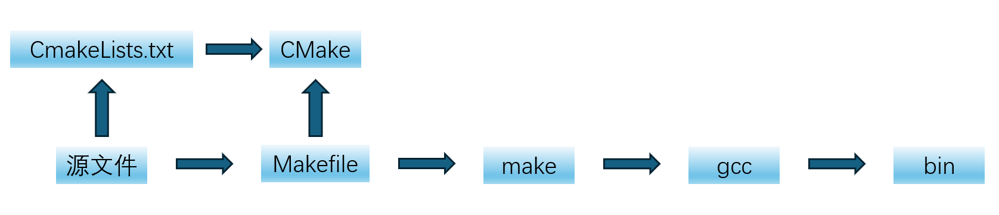

# Cmake学习笔记

## 一、核心概念

**gcc(GNU Complier Collection)** 将源文件**编译(Compile)** 成可执行文件或者库文件；

而当需要编译大量文件时，需要先说明先编译什么，后编译什么，这个过程称为**构建(Build)**。常用工具为**make**，其定义构建过程的文件为**Makefile**；

编写大型项目的Makefile十分复杂，通过**CMake**就可以更简洁的定义构建流程，其中CMake定义构建过程的文件为**CMakeLists.txt**。

其大致关系图如下：


## 二、编写例子

Cmake的命令格式：

- command (arg1 ag2 ...)
- command为cmake支持的命令，括号中是参数，**参数之间用空格分开**

> 比如生成一个静态库目标：
> add_library (${MATH_LIB} STATIC math.cpp)
> 指令为add_library指令，告诉cmake生成一个库目标。
>
> - 第一个参数表示要生成的库的目标的名字，这里取上层目录传入的变量MATH_LIB的值作为目标名。
>
> - 第二个参数STATIC表示生成一个静态库。
>
> - 第三个参数math.cpp表示cmake编译静态库需要的的源代码文件。

其中camke中主要概念为：命令（command），目标（target）和变量。
取值的方法为：**${var}**

CMakeFileLists.txt的一个基本框架：

```C
#一般都以这一行开始
cmake_minimum_required (VERSION 2.6)
 
#项目名
project (TEST)

...

#添加可执行目标文件Test
add_executable (Test main.cpp)
 
#LIBS变量存储所有需要链接的库
set (LIBS ${MATH_LIB})

#为可执行文件链接数学库
target_link_libraries (Test "${LIBS}")
```

### 小结

1. Cmake是通过CMakeLists.txt配置项目的构建系统，配合cmake命令行工具生成构建系统并执行编译、测试。
2. 最大的好处是一份make构建可以支持多个平台。
3. 指令格式为`command (arg1 ag2 ...)` **变量之间使用空格隔开**。
4. set指令可以给一个变量一个或者一组值，可以使用${var}的方式取变量的值。
5. 三种为CMake指定编译器的方式：
   （1）使用set命令通过修改CMAKE_CXX_COMPILER变量的方式指定编译器。
   （2）在系统环境变量中增加名为CC或者CXX的环境变量（分别对应C和C++的编译器）。**推荐使用**
   （3）在命令行执行cmake命令`cmake -D CMAKE_CXX_COMPILER=g++/clang++`。
