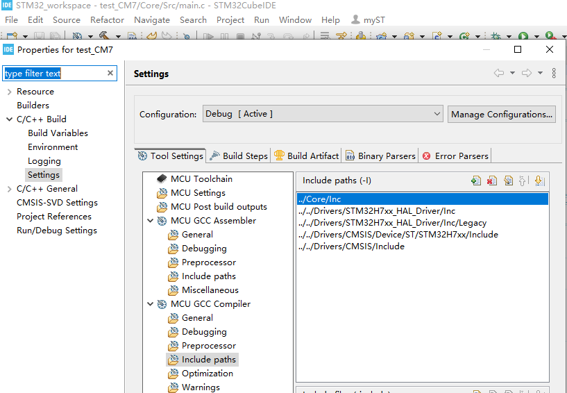

# 解决VSCode编辑Cube IDE路径报错飘红问题

[返回目录](../../Index.md)

首先，`Shift + Ctrl + P`打开VSCode配置输入`>c/c++`。
选择如下选项：
.png "编辑配置(UI)")

选择后，VSCode会自动生成.vscode文件夹和c_cpp_properties.json配置文件，打开配置文件，删除内同并将如下代码粘贴进去。

```json
{
    "configurations": [
        {
            "name": "STM32",
            "includePath": [
                "${workspaceFolder}/CM7/Core/Inc",
                "${workspaceFolder}/CM7/../Drivers/STM32H7xx_HAL_Driver/Inc",
                "${workspaceFolder}/CM7/../Drivers/STM32H7xx_HAL_Driver/Inc/Legacy",
                "${workspaceFolder}/CM7/../Drivers/CMSIS/Device/ST/STM32H7xx/Include",
                "${workspaceFolder}/CM7/../Drivers/CMSIS/Include"
            ],
            "defines": [
                "USE_HAL_DRIVER",
                "STM32H755xx"
            ],
            "compilerPath": "C:/ST/STM32CubeIDE_1.15.0/STM32CubeIDE/plugins/com.st.stm32cube.ide.mcu.externaltools.gnu-tools-for-stm32.12.3.rel1.win32_1.0.100.202403111256/tools/bin/arm-none-eabi-gcc.exe",
            "cStandard": "c99",
            "cppStandard": "c++11",
            "intelliSenseMode": "${default}"
        }
    ],
    "version": 4
}
```

其中最重要的是`includePath`、`defines`和`compilerPath`。

* `includePath`
    在STM32Cube IDE project -> properties下找到，并全部更换。
    
    全部复制后若报错，那么请注意看路径是什么，将鼠标放到路径上面就知道目前的路径是什么了，简单观察一下左侧文件夹目录和路径，并思考一下就知道到底应该是哪个路径了。
* `defines`
    更改为自己的芯片版本
* `compilerPath`
    找到STM32Cube IDE安装时自带的编译工具，路径应该与上述路径相似。根据上述路径找出自己的路径应该是什么。
