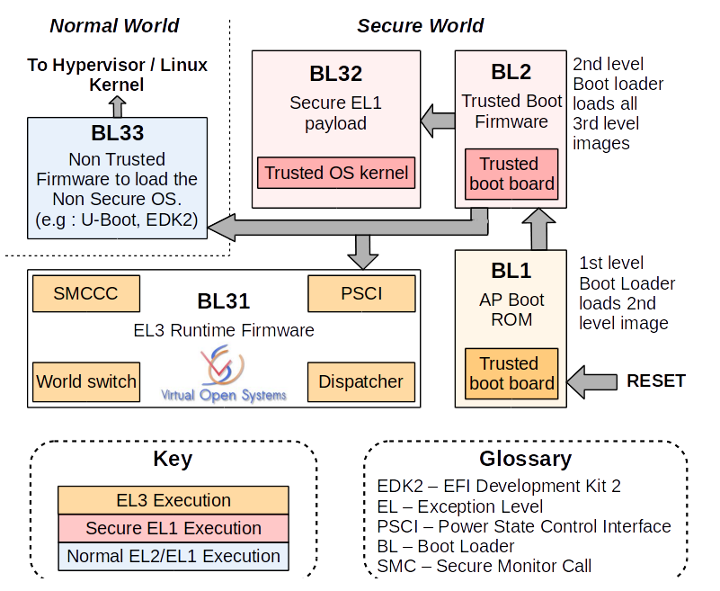

# ATF ARM可信固件

## 简介

ARM可信任固件（ARM Trusted Firmware，ATF）是由ARM官方提供的底层固件，该固件统一了ARM底层接口标准，如电源状态控制接口（Power Status Control Interface，PSCI）、安全启动需求（Trusted Board Boot Requirements，TBBR）、安全世界状态（SWS）与正常世界状态（NWS）切换的安全监控模式调用（secure monitor call，smc）操作等。ATF旨在将ARM底层的操作统一使代码能够重用和便于移植。

ATF的源代码共分为bl1、bl2、bl31、bl32、bl33五个部分，其中bl1、bl2、bl31部分属于固定的固件，bl32和bl33分别用于加载TEEOS和REE侧的镜像。整个加载过程可配置成安全启动的方式，每一个镜像文件在被加载之前都会验证镜像文件的电子签名是否合法。

ATF主要完成的功能如下：

1. 初始化安全世界状态运行环境、异常向量、控制寄存器、中断控制器、配置平台的中断。
2. 初始化ARM通用中断控制器（General Interrupt Controller，GIC）2.0版本和3.0版本的驱动初始化。
3. 执行ARM系统IP的标准初始化操作以及安全扩展组件的基本配置。
4. 安全监控模式调用（Secure Monitor Call，smc）请求的逻辑处理代码（Monitor模式/EL3）。
5. 实现可信板级引导功能，对引导过程中加载的镜像文件进行电子签名检查。
6. 支持自有固件的引导，开发者可根据具体需求将自有固件添加到ATF的引导流程中。

## ATF工作流程

ATF的code boot的整个启动过程如下：

**1. bl1 跳转到 bl2 执行**
   在 bl1 完成了 bl2 的 image 加载到RAM中的操作、中断向量表的设定以及其他相关 CPU 设定之后，在 bl1_main 函数中解析出 bl2 image 的描述信息，获取入口地址，并设定下一阶段的 CPU 的上下文，完成之后，调用 el3_exit 函数实现 bl1 到 bl2 的跳转，进入到 bl2 中执行。  
**2. bl2 跳转到 bl31 执行**
   在 bl2 中将会加载 bl31 , bl32, bl33的 image 到对应权限的 RAM 中，并将该三个 image 的描述信息组成一个链表保存起来，以备 bl31 启动 bl32 和 bl33 使用.在 AACH64 中，bl31 位 EL3 runtime software，运行时的主要功能是管理 smc 指令的处理和中断的主力，运行在 secure monitor 状态中。  
   bl32 一般为 TEE OS image。  
   bl33 为非安全 image，例如 uboot, linux kernel 等，当前该部分为 bootloader 部分的 image，再由 bootloader 来启动 linux kernel.  
   从 bl2 跳转到 bl31 是通过带入 bl3 1的 entry point info 调用 smc 指令触发在 bl1 中设定的 smc 异常来通过 cpu 将全向交给 bl31 并跳转到 bl31 中执行。  
**3. bl31 跳转到 bl32 执行**
   在 bl31 中会执行 runtime_service_inti 操作，该函数会调用注册到 EL3 中所有service的init函数，其中有一个service就是为TEE服务，该 service 的 init 函数会将 TEE OS 的初始化函数赋值给 bl32_init 变量，当所有的service执行完init后，在bl31中会调用 bl32_init 执行的函数来跳转到 TEE OS 的执行。  
**4. bl32 跳转到 bl33 执行**
   当 TEE_OS image 启动完成之后会触发一个 ID 为 TEESMC_OPTEED_RETURN_ENTRY_DONE 的 smc 调用来告知 EL3 TEE OS image 已经完成了初始化，然后将 CPU 的状态恢复到 bl31_init 的位置继续执行。  
   bl31 通过遍历在 bl2 中记录的 image 链表来找到需要执行的 bl33 的 image。然后通过获取到 bl33 image 的镜像信息，设定下一个阶段的 CPU 上下文，退出 el3 然后进入到 bl33 image 的执行。

## ATF启动流程一：bl1
