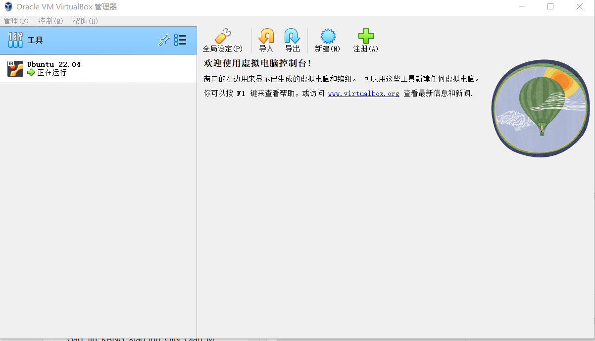
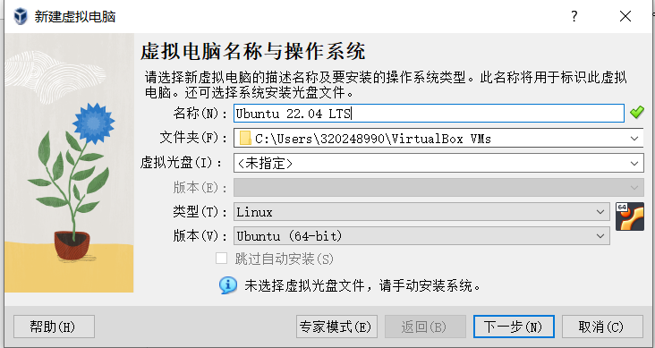
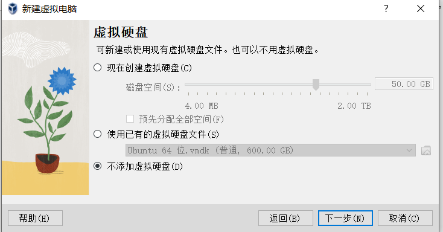
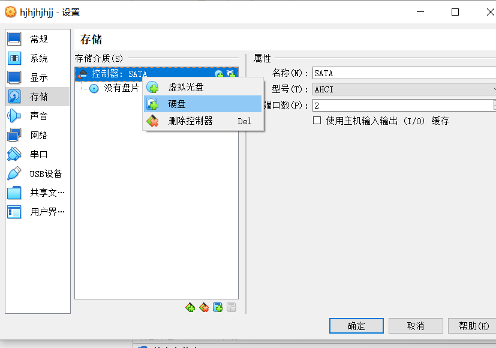
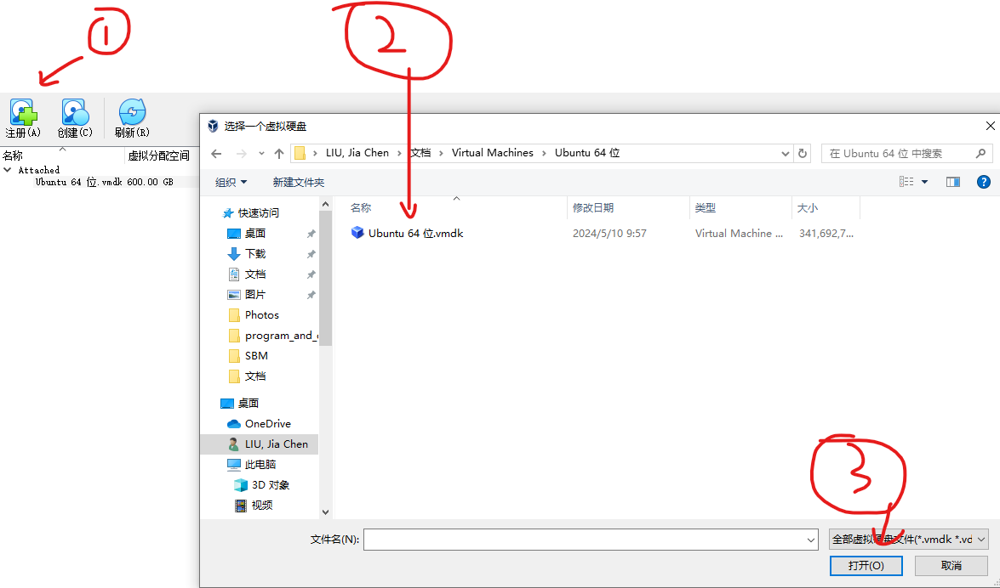
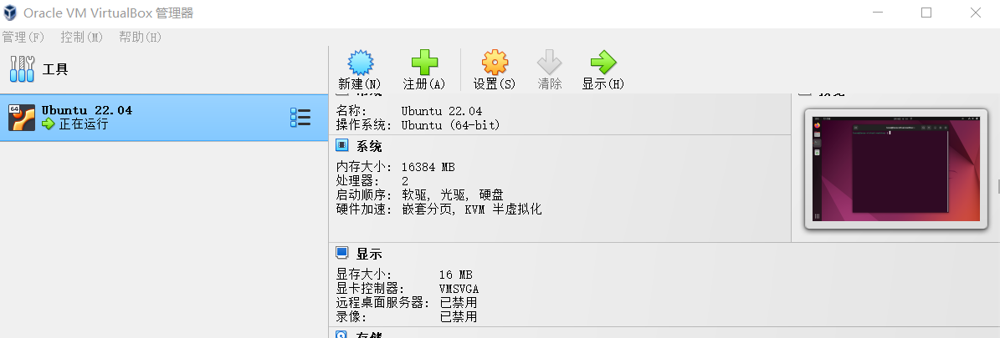

# 使用Virtual Box打开VMware的虚拟机

[返回](../Guidance.md)

## 下载并打开一个Virtual Box

## 不指定虚拟光盘和虚拟硬盘创建虚拟机

## 为新的虚拟机设置硬盘

选中新的虚拟机->右键->设置->存储->控制器->右键->硬盘->注册->选择VMware的.vmdk文件->选择->确认

## 就可以打开曾经一直使用的虚拟机了

