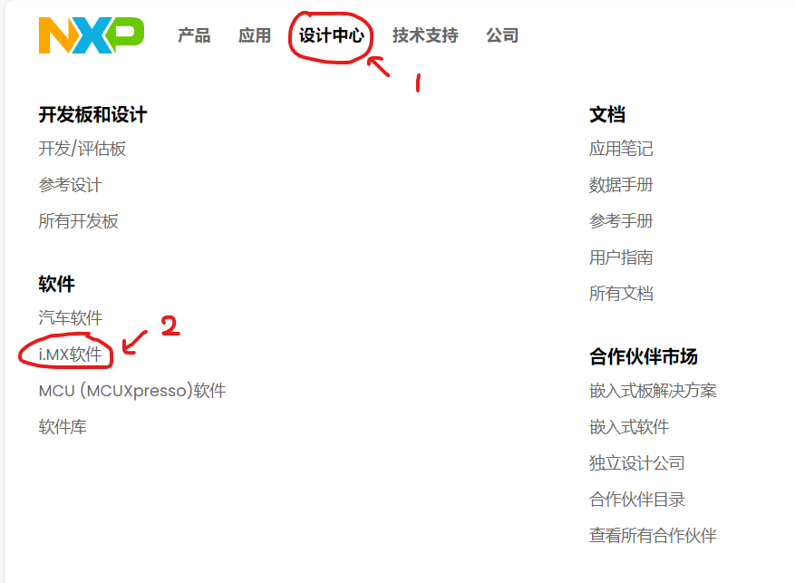
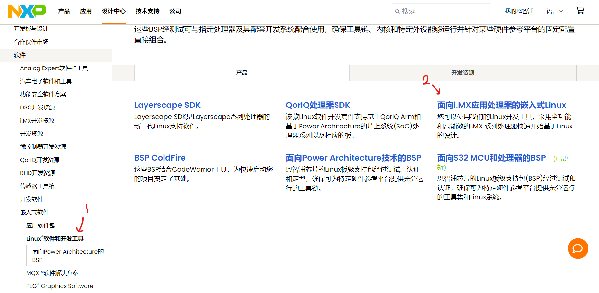
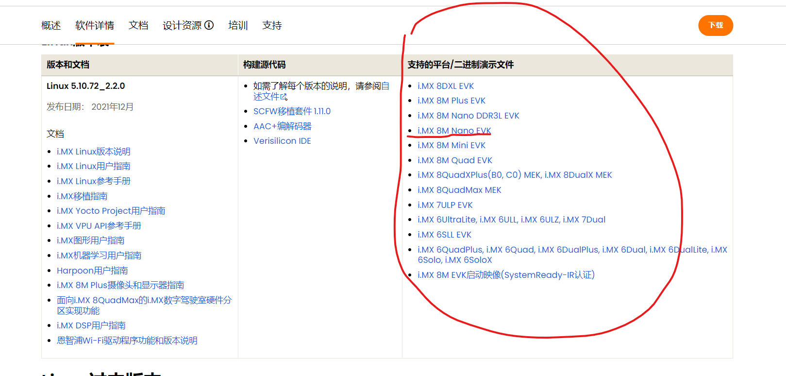

# U-boot的编译与烧录（非Yocto环境，iMX8M NANO）

[返回](./Index.md)

## 序言：安装Uuu

**1.安装依赖**:

```bash
sudo apt update
sudo apt install git build-essential libusb-1.0-0-dev pkg-config
```

**2.克隆Uuu仓库**：

```bash
git clone https://github.com/NXPmicro/mfgtools.git
```

**3.编译Uuu**：

```bash
cd mfgtools
make
```

**4.安装到可执行路径**：

```bash
sudo cp uuu /usr/local/bin/
```

## 一、烧录完整的操作系统镜像验证Uuu可用（可选）

在只烧录U-boot之前，可以通过直接获得并烧录官方提供的整个操作系统镜像的方式来熟悉使用Uuu工具。

### 1-1 获取镜像

**登录[i.MX官网](https://www.nxp.com.cn)->设计中心->iMX软件**


**在左侧目录栏中找到Linux软件和开发工具->面向i.MX应用处理器的嵌入式Linux**


**选择自己的平台对应的文件下载**


### 1-2 烧录

把下载的文件放到Uuu下载目录下，解压

```bash
unzip LF_v5.10.72-2.2.0_images_IMX8MNEVK.zip
```

进入Uuu下载文件夹

```bash
cd mfgtools
```

找到对应的uuu.auto文件执行如下命令（根据实际情况调整文件）：

```bash
sudo uuu uuu.auto-imx8mnddr4evk
```

使用板子验证即可。

## 二、编译U-boot

### 2-1 下载U-boot源码

通过如下链接下载U-boot源码：[i-mx-U-boot源码](https://github.com/nxp-imx/uboot-imx.git)

### 2-2 编译U-boot源码

进入源码文件

```bash
cd uboot-imx-lf_v2022.04
```

选择自己平台的配置文件进行编译，其中编译器选择aarch64-linux-gnu-gcc

```bash
sudo make clean
sudo make CROSS_COMPILE=aarch64-linux-gnu- imx8mn_ddr4_evk_defconfig
sudo make CROSS_COMPILE=aarch64-linux-gnu-
```

### 2-3 编译结果

应该可以找到如下文件：

> 1. u-boot-nodtb.bin；
> 2. spl / u-boot-spl.bin；
> 3. arch / arm / dts/ imx8mn-ddr4-evk.dtb。

## 三、烧录U-boot

### 3-1下载imx-mkimage、imx-atf和firmware-imx

下载imx-mkimage，并进入目录

```bash
git clone https://github.com/nxp-imx/imx-mkimage.git
cd imx-mkimage
```

查看远程分支

```bash
git branch -v
```

切换到与imx-5.4.70-2.3.0版本对应的分支上

```bash
git checkout imx_5.4.70_2.3.0
git pull origin
```

下载imx-atf，步骤与下载imx-mkimage相同

```bash
cd ..
git clone https://github.com/nxp-imx/imx-atf.git
cd imx-atf
git checkout imx_5.4.70_2.3.0
git pull origin
```

下载firmware-imx

```bash
cd ..
wget http://www.freescale.com/lgfiles/NMG/MAD/YOCTO/firmware-imx-8.1.bin
chmod +x firmware-imx-8.1.bin
sudo ./firmware-imx-8.1.bin --auto-accept
```

### 3-2 编译imx-atf，在不换平台的情况下只需编译一次，后面可以一直用

```bash
cd imx-atf
make clean PLAT=imx8mn
LDFLAGS="" make PLAT=imx8mn CROSS_COMPILE=aarch64-linux-gnu-
```

> 注意：
> 由于imx-atf的Makefile中的默认编译器不一定合适，为了避免报错，因此最后一行命令中增加了指定编译器的操作

编译成功后产生 `./build/imx8mn/release/bl31.bin` 文件。

### 3-3 使用imx-mkimage链接所有的文件生成二进制文件

``` bash
# uboot-imx
 cp uboot-imx-lf_v2022.04/tools/mkimage                                     ./imx-mkimage/iMX8M/mkimage_uboot
 cp uboot-imx-lf_v2022.04/arch/arm/dts/imx8mn-ddr4-evk.dtb                  ./imx-mkimage/iMX8M/imx8mn-ddr4-evk.dtb
 cp uboot-imx-lf_v2022.04/spl/u-boot-spl.bin                                ./imx-mkimage/iMX8M/
 cp uboot-imx-lf_v2022.04/u-boot-nodtb.bin                                  ./imx-mkimage/iMX8M/
 ​
# firmware-imx  在这里区分使用 LPDDR4 还是 DDR4，具体请参考自己的平台
 cp firmware-imx-8.10/firmware/ddr/synopsys/ddr4_dmem_1d.bin    ./imx-mkimage/iMX8M/
 cp firmware-imx-8.10/firmware/ddr/synopsys/ddr4_dmem_2d.bin    ./imx-mkimage/iMX8M/
 cp firmware-imx-8.10/firmware/ddr/synopsys/ddr4_imem_1d.bin    ./imx-mkimage/iMX8M/
 cp firmware-imx-8.10/firmware/ddr/synopsys/ddr4_imem_2d.bin    ./imx-mkimage/iMX8M/
 cp firmware-imx-8.10/firmware/ddr/synopsys/ddr4_imem_1d_201810.bin    ./imx-mkimage/iMX8M/
 cp firmware-imx-8.10/firmware/ddr/synopsys/ddr4_imem_2d_201810.bin    ./imx-mkimage/iMX8M/
 cp firmware-imx-8.10/firmware/ddr/synopsys/ddr4_dmem_1d_201810.bin    ./imx-mkimage/iMX8M/
 cp firmware-imx-8.10/firmware/ddr/synopsys/ddr4_dmem_2d_201810.bin    ./imx-mkimage/iMX8M/
 ​
# imx-atf
 cp imx-atf/build/imx8mn/release/bl31.bin                       ./imx-mkimage/iMX8M/
```

拷贝文件到对应的目录下面之后就可以进行编译了，其中仍然需要注意使用的是 LPDDR4 还是 DDR4

```bash
cd imx-mkimage
make SOC=iMX8MN clean
make SOC=iMX8MN flash_ddr4_evk
```

最后产生`./imx-mkimage/iMX8M/flash.bin`说明成功。

### 3-4 烧录

将3-4生成的`flash.bin`文件拷贝到uuu的下载文件夹下

```bash
sudo cp ~/imx-mkimage/iMX8M/flash.bin ~/mfgtools
```

更改将要运行的烧录的`uuu.auto`脚本文件

> uuu_version 1.2.39
>
> \# This command will be run when i.MX6/7 i.MX8MM, i.MX8MQ  
> SDP: boot -f flash.bin  \#更改为flash.bin  
> \#SDP: boot -f imx-boot-imx8mnddr4evk-sd.bin-flash_ddr4_evk  
>
> \# This command will be run when ROM support stream mode  
> \# i.MX8QXP, i.MX8QM  
> SDPS: boot -f flash.bin \#更改为flash.bin  
> \#SDPS: boot -f imx-boot-imx8mnddr4evk-sd.bin-flash_ddr4_evk  
>
> \# These commands will be run when use SPL and will be skipped if > no spl  
> \# SDPU will be deprecated. please use SDPV instead of SDPU  
> \# {  
> SDPU: delay 1000  
> SDPU: write -f imx-boot-imx8mnddr4evk-sd.bin-flash_ddr4_evk -offset > 0x57c00  
> SDPU: jump  
> \# }
>
> \# These commands will be run when use SPL and will be skipped if > no spl  
> \# if (SPL support SDPV)  
> \# {  
> SDPV: delay 1000  
> SDPV: write -f imx-boot-imx8mnddr4evk-sd.bin-flash_ddr4_evk -skipspl  
> SDPV: jump  
> \# }
>
> FB: ucmd setenv fastboot_dev mmc  
> FB: ucmd setenv mmcdev \${emmc_dev}  
> FB: ucmd mmc dev \${emmc_dev}  
> FB: flash -raw2sparse all imx-image-multimedia-imx8mnevk.wic  
> FB: flash bootloader imx-boot-imx8mnddr4evk-sd.bin-flash_ddr4_evk  
> FB: ucmd if env exists emmc_ack; then ; else setenv emmc_ack 0; fi;  
> FB: ucmd mmc partconf \${emmc_dev} \${emmc_ack} 1 0  
> FB: done

运行以下命令烧录：

```bash
sudo uuu ~/mfgtools/uuu.auto-imx8mnddr4evk
```

这个脚本里面不只有u-boot其中kernel也进行了烧录，如果后面只是更改了U-boot那么可以运行下面的命令只烧录U-boot而不动kernel

```bash
sudo uuu -b emmc flash.bin
```

> **注意**：
> 在烧录时请先将开发板连接到PC，如果是虚拟机需要连接到虚拟机（不是线脸上就行了，要让虚拟机识别到，需要在设置中手动连接）。然后通过`uuu -lsusb`命令来查看是否连上。之后就可以烧录了
