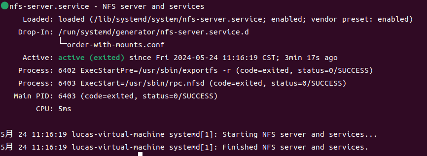
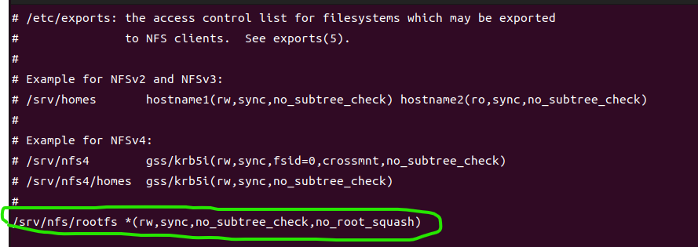
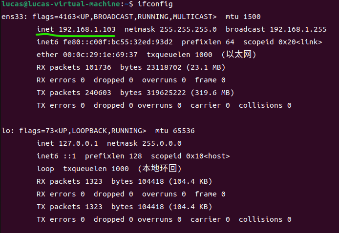
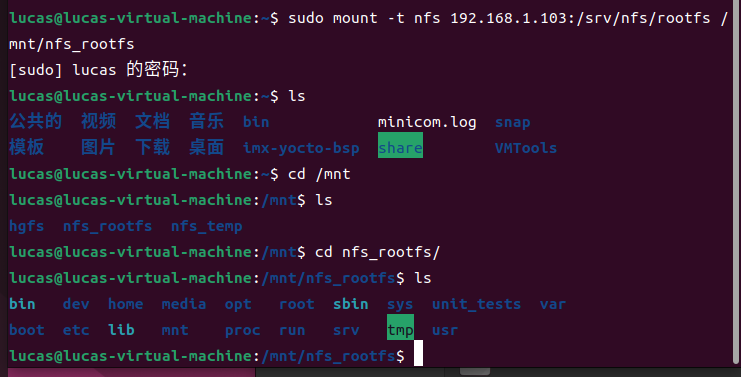
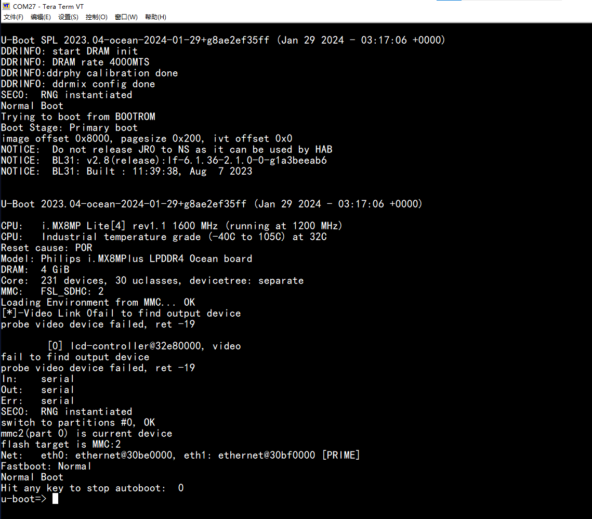
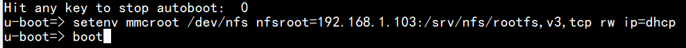
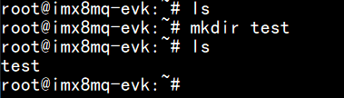
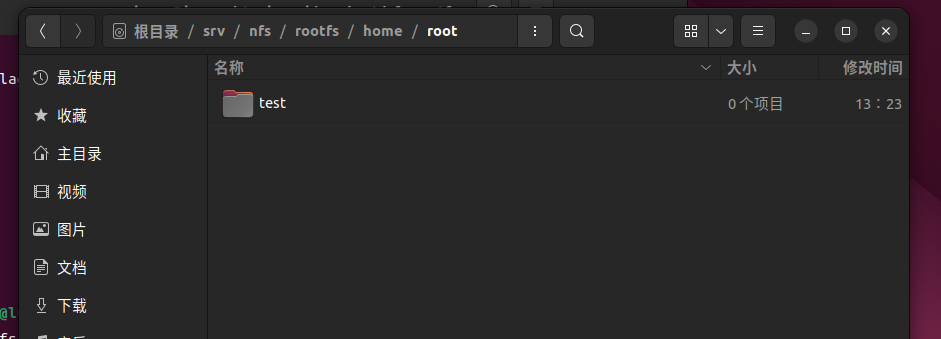

# 在板子上的U-boot挂载虚拟机上的rootfs

[返回](../Guidance.md)

## 一、安装NFS

### 1-1 什么是NFS

NFS（Network File System）是一种分布式文件系统协议，它允许在网络上的计算机之间共享文件和目录。
NFS的工作原理是将文件系统挂载到远程计算机上，使得远程计算机可以像本地文件系统一样访问共享的文件和目录。
NFS使用客户端-服务端模型，其中客户端计算机通过网络连接到NFS服务器上，请求访问共享的文件和目录。NFS服务器讲文件和目录的内容传输到客户端的计算机上，使得客户端可以先访问本地文件一样访问共享的文件和目录。

## 1-2 安装NFS

**下载**
`sudo apt-get install nfs-kernel-server`

**重启NFS服务**
`sudo systemctl restart nfs-server`

**查看NFS服务器状态**
`systemctl status nfs-server`
如下看到服务器Active说明NFS服务器已经启动了。

## 二、修改NFS服务器配置文件

**打开配置文件**
`sudo vi /etc/exports`

在文件中最后一行加入如下语句：
`/srv/nfs/rootfs *(rw,sync,no_subtree_check,no_root_squash)`

语句含义：

1. /srv/nfs/rootfs:自己设置的共享的目录
2. *：通配符，表示不限定客户端，也可以设置为客户端的IP如192.168.1.101
3. rw：表示此共享目录共享之后的权限，rw表示可读可写
4. sync：将数据同步写入内存缓冲区与磁盘中，效率低，但可以保证数据的一致性
5. no_subtree_check：即使输出目录是一个子目录，NFS服务器也不会检查其父目录的权限，这样可以提高效率
6. no_root_squash：来访的root用户保持root账号权限

## 三、验证是否已经可以挂载（可选）

通过本地文件挂载的方式验证是否已经可以进行NFS文件挂载

### 3-1 查看虚拟机的IP地址

输入如下命令查看虚拟机的IP地址
`ifconfig`

### 3-2 挂载

输入如下指令进行挂载
`sudo mount -t nfs 192.168.1.103:/srv/nfs/rootfs /mnt/nfs_rootfs`

1. mount: Linux 系统中用于挂载文件系统的命令。
2. -t nfs: 指定文件系统类型为 NFS。-t 是 mount 命令的选项之一，用于指定文件系统类型，而 nfs 就是 NFS 文件系统的类型。
3. 192.168.1.103:/srv/nfs/rootfs: NFS 文件系统的位置。192.168.1.103 是 NFS 服务器的 IP 地址，/srv/nfs/rootfs 是共享的路径。
4. /mnt/nfs_rootfs: 挂载点，也就是将 NFS 文件系统挂载到本地文件系统的位置。在这里，NFS 文件系统的内容将被挂载到 /mnt/nfs_rootfs 目录下。

### 3-3 进入文件夹查看是否挂载成功

可以看到/mnt/nfs_rootfs/下已经有了rootfs的文件

## 四、让U-boot挂载虚拟机的rootfs

### 4-1 进入U-boot界面

机器上电后等待提示暂停autoboot，暂停后就进入了U-boot命令行

### 4-2 配置U-boot环境变量

`u-boot => setenv mmcroot /dev/nfs nfsroot=192.168.1.103:/srv/nfs/rootfs,v3,tcp rw ip=dhcp`
`u-boot => boot`

由于Yocto构建时使用普通用户进行的，所以生成的rootfs的所有者和组都是普通用户而不是root。在nfs挂载前务必chown -R root:root /srv/nfs/rootfs，否则kernel不能正常启动会进入维护模式。

### 4-3 进入用户界面进行验证

进入用户界面新建一个文件夹，进入Ubuntu中查看，发现确实有一个文件夹生成，说明挂载成功。

