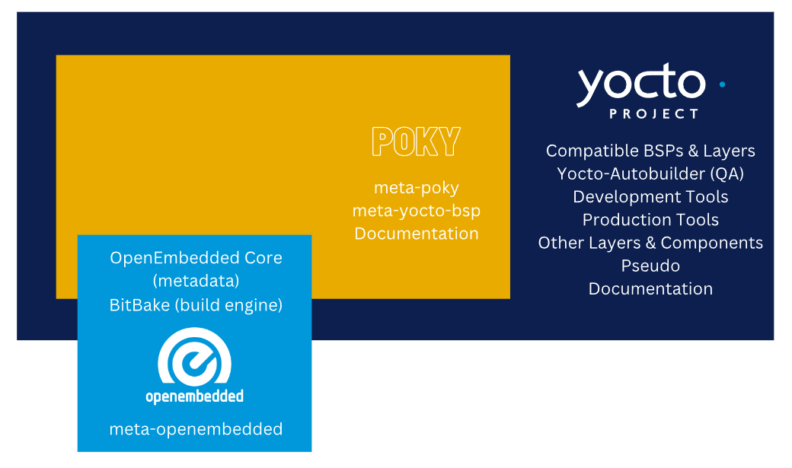
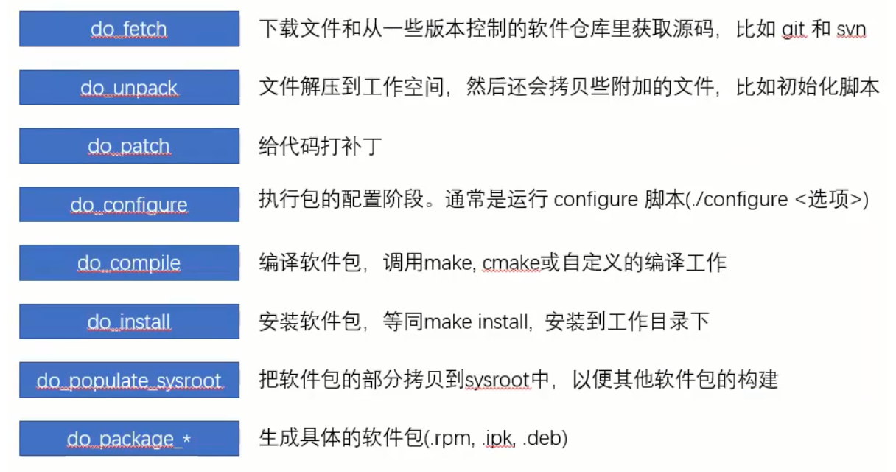

# Yocto指北

[返回目录](../Index.md)
[下载指南](./Download_Guidance.md)

## 一、简介

在嵌入式产品开发中，通常需要定制自己的的Linux发行版，所谓的发行版，即根据自家产品的功能和特性定制bootloader、kernel、rootfs，最后得到这三个的镜像文件。
然而定制Linux发行版是一个费时费力并且技术含量比较高的大工程。
Yocto，是一个开源社区。它通过提供模板、工具和方法帮助开发者创建基于Linux内核的定制系统，支持ARM、MIPS、PPC、x86等多种硬件体系架构。
Yocto Project是一个开源协作软件，提供模板、工具和方法帮助创建定制的Linux系统和嵌入式产品，而无需关心硬件体系。极大的简化了整个开发工程，因为你不用再从头裁剪一个Linux发行版。

1. 核心组件
   * OpenEmbedded Core(OE-Core):提供了一些工具和类，用于构建和管理Linux内核的软件包。
   * Bitbake：一个Python编写的构建工具，用于定义和执行构建任务。
   * Metadata：元数据包括用于构建Linux发行版的各种配置文件、脚本和类。
2. 主要概念
   * **Layer：Yocto Project使用层的概念来组织和扩展功能。每个层都包含了一组相关的配置、软件包和元数据。**
   * Recipe：一个recipe是一个用于构建软件包的脚本，其中包含了构建该软件包的所有信息，比如下载源代码、配置选项、编译参数等。
   * Image：一个image是一个嵌入式Linux系统的镜像，包含了内核、文件系统和所需的应用程序等组件。
3. 工作流程
   * 配置：通过编辑配置文件和层来配置Yocto Project以满足特定的需求。
   * 构建：使用bitbake工具执行构建任务，bitbake将根据配置和recipe构建所需的软件包和镜像。
   * 调试和定制：通过调试工具和自定义recipe来调试和定制生成Linux系统。

## 二、Yocto Project组成

## 三、Poky

Poky是Yocto的发行版，是用来构建系统的基本工具。Poky报刊和定制版OpenEmbedded(OE-Core)、bitbake构建引擎和构建系统所需的元数据。
多数情况下，Poky都是作为一个参考的项目。

## 四、Bitbake

bitbake是一个灵活强大的构建引擎，基于python之上构建的语言。
bitbake最后将构建的metadata，将python或shell写的脚本，决定哪些先执行，哪些后执行。
使用BitBake的最主要目的是生成一些安装包、内核、SDK以及一个完整的嵌入式Linux发行版(U-Boot、Kernel、Rootfs、DeviceTree)，这些安装包或目标文件就构成了一个完成的嵌入式Linux发行版。
BitBake命令格式为：`bitbake target`

### 4-1 解析Metadata基本配置文件

Bitbake构建的第一步就是解析Metadata基本配置文件。

#### 4-1-1元数据

在获取到Yocto项目之后，source目录下有一些文件夹，这些文件夹就是一个个的metadata。
在source目录下有一些文件夹名称为meta-xxx，构建不同的嵌入式Linux发行版本使用不同的metadata，而具体需要用到哪些meatadata则是由通过`imx-setup-release.sh`脚本初始化构建目录时确定的。
在使用`imx-setup-release.sh`脚本时，会创建一个build文件夹，在build/conf路径下，生成了一个bblayers.conf的配置文件，BitBake工具会根据该bblayers.conf文件中的定义，确定使用那些metadata用于构建嵌入式Linux发行版。

#### 4-1-2 meta-xxx文件夹(recipes、conf、classes)

在meta-xxx文件夹下存放着许多文件，用于构建嵌入式Linux系统。其中三个十分重要

* class：这个文件夹下面存放着.bbclasses文件，其中包含了一些在不同的metadata之间共享的信息，以及编译信息的抽象，比如：如何编译Linux内核。
* conf：这个文件夹下的`layer.conf`文件定义了该metadata中使用哪些 .bb、.bbappend文件参与构建嵌入式Linux系统。
* recipes-xxx：这个文件夹下有许多的 .bb、.bappend文件，这些文件定义了构建嵌入式Linux系统需要的软件包或源码等，主要包括：

> 软件包的基本信息：作者、主页、License等  
>版本信息  
>依赖文件  
>从哪下载以及如何下载软件包  
>软件包补丁信息:是否需要补丁、补丁下载地址及方式等  
>如何配置、如何编译软件包、安装位置等

#### 4-1-3 小结

总的来说，解析Metadata的过程就是：
BitBake根据build/conf/bblayers.conf中定义的所使能的layers（meta-xxx），找到对应meta-xxx文件夹下的layer.conf文件，根据layer.conf文件中所使用的.bb或.bbappend文件中定义的软件包或源码的下载、配置、编译方式、安装目录等，将需要的软件包或源码编译进根文件系统（使用的软件包等最终是安装在根文件系统中。

> 可以通过BitBake提供的命令查看当前使用的配置文件和class文件：
> `bitbake -e > mybb.log`

### 4-2 解析recipes

Bitbake解析了Metadata基本配置之后，Bitbake会根据build/conf/bblayers.conf中定义的所使能的layers(meta-xxx)，找到对应的meta-xxx文件夹下的conf文件夹下的layer.conf文件。在layer.conf文件中，通过bbFILES和bbPATH制定了当前layer使用了哪些recipes。其中bbPATH会告诉bitbake在那些路径下，找到哪些.bb和.bbappend文件(bbFILES)，这个bbFILES会告诉bitbake，要使用哪些软件包或者源码来构建嵌入式Linux系统。

>通常来说，bbFILES以PN(package name)加PV(package version)命名，如：something_1.2.3.bb，PN=something，PV= 1.2.3。

当recipe解析完成后，会生成一个“任务列表”，接下来就是BitBake根据“任务列表”（bbFILES中定义的内容数据等）进行系统的构建。实际上，在构建系统过程中，就是以一个个task的形式进行的。

BitBake构建系统时，都会分为多个任务执行，例如：fetch, unpack, patch, configure以及compile 。对于构建系统所使用的主机是多核的情况，BitBake内部会对各任务的依赖关系进行处理，不需要用户干预。

